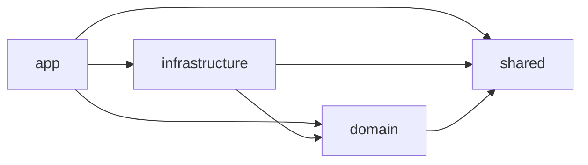
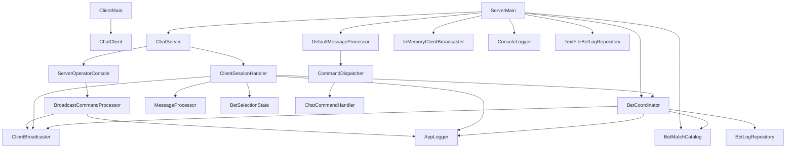

# Socket Chat Java - Documentación Técnica Integral (Clase por Clase)

> Estado del documento: alineado con el código actual de `src/com/tpsockets`.

## Tabla de contenido

1. [Visión global del sistema](#visión-global-del-sistema)
2. [Arquitectura por capas y dependencias](#arquitectura-por-capas-y-dependencias)
3. [Flujo operativo end-to-end](#flujo-operativo-end-to-end)
4. [Mapa de clases y relaciones](#mapa-de-clases-y-relaciones)
5. [Documentación clase por clase](#documentación-clase-por-clase)
6. [Patrones de diseño aplicados y justificación técnica](#patrones-de-diseño-aplicados-y-justificación-técnica)
7. [Tipos de datos elegidos y por qué](#tipos-de-datos-elegidos-y-por-qué)
8. [Concurrencia, consistencia y manejo de errores](#concurrencia-consistencia-y-manejo-de-errores)
9. [Escenarios de uso con ejemplos](#escenarios-de-uso-con-ejemplos)
10. [Extensión futura recomendada](#extensión-futura-recomendada)

---

## Visión global del sistema

Este proyecto implementa un chat cliente-servidor sobre TCP con una arquitectura limpia para un TP académico, priorizando:

- separación de responsabilidades,
- bajo acoplamiento,
- extensibilidad de comandos,
- trazabilidad de eventos,
- y flujo de negocio adicional (`BET`) sin romper el chat base.

Capacidades funcionales actuales:

- conexión de múltiples clientes,
- registro de nombre de cliente (`clientId`) con validación y unicidad,
- comandos de chat (`HELLO`, `TIME`, `DATE`, `HELP`, `MUNDIAL`, `UPPER`, `SALIR`),
- broadcast desde consola de servidor,
- sistema de apuestas por menú (`BET`) con persistencia en archivo y difusión en tiempo real.

---

## Arquitectura por capas y dependencias

### Capas

- `app`: puntos de entrada (`ClientMain`, `ServerMain`).
- `domain`: reglas de negocio puras y contratos del dominio.
- `infrastructure`: red (sockets), logging por consola, persistencia en archivo.
- `shared`: configuración y contratos transversales (por ejemplo, logging).

### Estructura de paquetes

```text
com.tpsockets
├─ app
│  ├─ client/ClientMain.java
│  └─ server/ServerMain.java
├─ domain
│  ├─ MessageProcessor.java
│  ├─ DefaultMessageProcessor.java
│  ├─ ChatCommandHandler.java
│  ├─ CommandDispatcher.java
│  └─ bet/
│     ├─ BetMatch.java
│     ├─ BetEntry.java
│     ├─ BetSelectionState.java
│     ├─ BetMatchCatalog.java
│     ├─ BetLogRepository.java
│     └─ BetCoordinator.java
├─ infrastructure
│  ├─ console/ConsoleLogger.java
│  ├─ network/
│  │  ├─ ChatClient.java
│  │  ├─ ChatServer.java
│  │  ├─ ClientSessionHandler.java
│  │  ├─ ClientBroadcaster.java
│  │  ├─ InMemoryClientBroadcaster.java
│  │  ├─ BroadcastCommandProcessor.java
│  │  └─ ServerOperatorConsole.java
│  └─ bet/TextFileBetLogRepository.java
└─ shared
   ├─ Config.java
   └─ logging/AppLogger.java
```

### Dependencias de alto nivel



`ServerMain` funciona como **composition root**: ensambla todas las dependencias concretas y las inyecta.

---

## Flujo operativo end-to-end

## 1) Arranque del servidor

1. `ServerMain` crea logger, processor, broadcaster, repositorio BET y `BetCoordinator`.
2. Inyecta todo en `ChatServer`.
3. `ChatServer.start()`:
   - inicia el hilo de consola de operador,
   - abre `ServerSocket`,
   - acepta clientes y crea un `ClientSessionHandler` por conexión.

## 2) Arranque del cliente

1. `ClientMain` crea `ChatClient(host, port)`.
2. `ChatClient.start()` abre socket y streams.
3. Ejecuta handshake de `clientId`.
4. Inicia hilo lector del servidor + loop de input de consola local.

## 3) Ciclo de una sesión de cliente

1. servidor valida/registrar `clientId`.
2. por cada línea:
   - intenta flujo `BET` (si corresponde al estado),
   - sino pasa por `MessageProcessor`.
3. envía respuesta,
4. si llega `SALIR`, cierra sesión.

---

## Mapa de clases y relaciones



---

## Documentación clase por clase

## `com.tpsockets.shared.Config`

**Tipo:** clase utilitaria de constantes (`public static final`).  
**Responsabilidad:** concentrar configuración y mensajes de protocolo.

### Fragmento

```java
public static final int PORT = 3000;
public static final String HOST = "localhost";
public static final String EXIT_COMMAND = "SALIR";
public static final String BET_COMMAND = "BET";
public static final String BET_CANCEL_COMMAND = "CANCELAR";
public static final String BET_LOG_FILE = "bets-log.txt";
```

### Justificación técnica

- Evita *magic strings* repetidos en varias clases.
- Reduce errores de consistencia del protocolo texto.
- Hace explícita la “superficie pública” de comandos/mensajes.

---

## `com.tpsockets.shared.logging.AppLogger`

**Tipo:** interfaz (puerto de logging).  
**Responsabilidad:** abstraer el mecanismo de logs.

### Fragmento

```java
public interface AppLogger {
  void logInfo(String message);
  void logReceived(String message);
  void logSent(String message);
  void logConnection(String clientInfo);
  void logDisconnection(String clientInfo);
  void logError(String errorMessage);
}
```

### Justificación técnica

- Aplicación directa de **DIP (Dependency Inversion Principle)**.
- La infraestructura de red ya no depende de `ConsoleLogger` concreto.
- Permite cambiar a logger de archivo, JSON, SLF4J, etc., sin romper consumidores.

---

## `com.tpsockets.infrastructure.console.ConsoleLogger`

**Tipo:** implementación concreta de `AppLogger`.  
**Responsabilidad:** salida de eventos a consola.

### Fragmento

```java
@Override
public void logError(String errorMessage) {
  System.err.println("[ERROR] " + errorMessage);
}
```

### Relación

- Se instancia en `ServerMain`.
- Se inyecta a `ChatServer`, `ClientSessionHandler`, `BroadcastCommandProcessor`, `BetCoordinator`.

---

## `com.tpsockets.app.client.ClientMain`

**Tipo:** punto de entrada (`main`).  
**Responsabilidad:** bootstrap mínimo del cliente.

### Fragmento

```java
ChatClient chatClient = new ChatClient(Config.HOST, Config.PORT);
chatClient.start();
```

### Justificación

- Mantiene el arranque sin lógica de infraestructura embebida.
- Facilita sustituir `ChatClient` por otro cliente en el futuro.

---

## `com.tpsockets.app.server.ServerMain`

**Tipo:** punto de entrada + composition root.  
**Responsabilidad:** ensamblado de dependencias del servidor.

### Fragmento

```java
AppLogger logger = new ConsoleLogger();
MessageProcessor messageProcessor = new DefaultMessageProcessor();
ClientBroadcaster clientBroadcaster = new InMemoryClientBroadcaster();
BetLogRepository betLogRepository = new TextFileBetLogRepository(Path.of(Config.BET_LOG_FILE));
BetCoordinator betCoordinator =
    new BetCoordinator(new BetMatchCatalog(), betLogRepository, clientBroadcaster, logger);
ChatServer chatServer =
    new ChatServer(Config.PORT, messageProcessor, logger, clientBroadcaster, betCoordinator);
```

### Justificación técnica

- La inyección centralizada evita `new` dispersos dentro de clases de negocio.
- Hace explícita la topología del sistema en un único lugar.

---

## `com.tpsockets.infrastructure.network.ChatClient`

**Responsabilidad principal:** cliente TCP interactivo por consola.

### Propiedades

- `private final String host;`
- `private final int port;`

### Validaciones constructor

```java
boolean isHostValid = host != null && !host.isBlank();
boolean isPortValid = port > 0 && port <= 65535;
```

### Secuencia técnica de `start()`

1. Crea `Socket`, `BufferedReader`, `PrintWriter`, `Scanner` en `try-with-resources`.
2. Ejecuta handshake (`performClientIdHandshake`).
3. Inicia hilo daemon para leer mensajes del servidor.
4. Loop de input local y envío por `writer.println(...)`.

### Fragmento de manejo de errores

```java
} catch (ConnectException e) {
  System.err.println("Error de conexión: servidor no disponible en " + host + ":" + port + ".");
} catch (IOException e) {
  System.err.println("Error de conexión: " + e.getMessage());
}
```

### Justificación técnica

- `ConnectException` separado permite diagnóstico más claro que un `IOException` genérico.
- Hilo lector desacopla lectura asíncrona del loop de input.

---

## `com.tpsockets.infrastructure.network.ChatServer`

**Responsabilidad principal:** servidor TCP y aceptación de sesiones.

### Propiedades clave

- `port`, `messageProcessor`, `logger`, `clientBroadcaster`, `betCoordinator`, `serverOperatorConsole`.

### Fragmento (aceptación de conexiones)

```java
while (true) {
  var clientSocket = serverSocket.accept();
  logger.logInfo("Cliente aceptado: " + clientSocket.getRemoteSocketAddress());

  var handler =
      new ClientSessionHandler(clientSocket, messageProcessor, logger, clientBroadcaster, betCoordinator);
  new Thread(handler).start();
}
```

### Justificación técnica

- Modelo **thread-per-connection**: simple, explícito y suficiente para escala moderada.
- Inyección de `MessageProcessor` y `ClientBroadcaster` evita acoplar lógica de red y dominio.

---

## `com.tpsockets.infrastructure.network.ClientSessionHandler`

**Responsabilidad principal:** ciclo de vida completo de una sesión cliente en servidor.

### Dependencias

- `MessageProcessor`
- `AppLogger`
- `ClientBroadcaster`
- `BetCoordinator`

### Estado local por sesión

- `String clientId`
- `PrintWriter writer`
- `BetSelectionState betSelectionState`

### Validación de nombre de cliente

```java
private static final Pattern CLIENT_ID_PATTERN = Pattern.compile("^[a-zA-Z0-9_-]{3,20}$");
```

### Fragmento de handshake

```java
clientBroadcaster.println(writer, Config.CLIENT_ID_PROMPT);
String candidate = reader.readLine();
...
boolean registered = clientBroadcaster.register(trimmedCandidate, writer);
if (!registered) {
  clientBroadcaster.println(writer, Config.CLIENT_ID_IN_USE_MESSAGE);
  continue;
}
clientBroadcaster.println(writer, Config.CLIENT_ID_ASSIGNED_PREFIX + trimmedCandidate);
```

### Fragmento de clasificación de desconexiones

```java
} catch (SocketException e) {
  if (clientId == null) {
    logger.logInfo("Conexión abortada durante handshake: " + remoteAddress + " (" + e.getMessage() + ")");
  } else {
    logger.logError("Conexión reseteada para " + clientId + " (" + remoteAddress + "): " + e.getMessage());
  }
}
```

### Lógica BET embebida por estado

```java
if (betSelectionState.step() == BetSelectionState.Step.IDLE
    && trimmedLine.equalsIgnoreCase(Config.BET_COMMAND)) {
  betSelectionState.startSelection();
  return betCoordinator.renderMatchList() + "\n" + Config.BET_PROMPT_SELECT_MATCH;
}
```

### Justificación técnica

- Esta clase es un **orquestador de sesión**.
- Mantiene explícito el orden de procesamiento: primero `BET` (si aplica), luego `MessageProcessor`.
- `finally` asegura `unregister` del cliente para no dejar referencias huérfanas.

---

## `com.tpsockets.infrastructure.network.ClientBroadcaster`

**Tipo:** interfaz de envío/registro de clientes.

### Fragmento

```java
boolean register(String clientId, PrintWriter writer);
void unregister(String clientId);
void broadcast(String message);
boolean broadcastToClient(String clientId, String message);
int connectedClientsCount();
```

### Método `default` reutilizable

```java
default void println(PrintWriter writer, String message) {
  synchronized (writer) {
    writer.println(message);
  }
}
```

### Justificación técnica

- Consolidar sincronización de escritura reduce duplicación y riesgo de interleaving.

---

## `com.tpsockets.infrastructure.network.InMemoryClientBroadcaster`

**Responsabilidad:** implementación concurrente en memoria de `ClientBroadcaster`.

### Estructura central

```java
private final Map<String, PrintWriter> clientWritersById = new ConcurrentHashMap<>();
```

### Registro atómico

```java
return clientWritersById.putIfAbsent(normalizedClientId, writer) == null;
```

### Justificación técnica

- `ConcurrentHashMap` evita condiciones de carrera entre sesiones concurrentes.
- Normalización (`trim + lowercase`) garantiza unicidad lógica de IDs.

---

## `com.tpsockets.infrastructure.network.BroadcastCommandProcessor`

**Responsabilidad:** interpretar comandos de broadcast escritos en consola del servidor.

### Fragmento de detección

```java
boolean isBroadcastCommand = normalizedLine.equals(Config.SERVER_BROADCAST_COMMAND);
boolean isBroadcastWithMessage = normalizedLine.startsWith(Config.SERVER_BROADCAST_COMMAND + " ");
```

### Casos soportados

- `BROADCAST <mensaje>` -> todos.
- `BROADCAST ALL <mensaje>` -> todos explícito.
- `BROADCAST <CLIENT_ID> <mensaje>` -> un cliente.

### Justificación técnica

- Extraer parsing de operador fuera de `ChatServer` aplica SRP.
- Retorna `boolean` para indicar si consumió comando (útil para extensiones de consola).

---

## `com.tpsockets.infrastructure.network.ServerOperatorConsole`

**Responsabilidad:** leer stdin del proceso servidor y delegar al procesador de comandos de operador.

### Fragmento

```java
Thread operatorThread = new Thread(() -> {
  try {
    BufferedReader consoleReader = new BufferedReader(new InputStreamReader(System.in));
    String line;
    while ((line = consoleReader.readLine()) != null) {
      broadcastCommandProcessor.process(line);
    }
  } catch (IOException e) {
    logger.logError("Error leyendo consola de servidor: " + e.getMessage());
  }
});
operatorThread.setDaemon(true);
operatorThread.start();
```

### Justificación técnica

- Hilo daemon evita bloquear el ciclo de `accept()` del servidor.

---

## `com.tpsockets.domain.MessageProcessor`

**Tipo:** interfaz de estrategia de comandos base.

```java
public interface MessageProcessor {
  String process(String message);
}
```

### Justificación

- Contrato mínimo y estable.
- Permite múltiples estrategias de procesamiento sin modificar infraestructura.

---

## `com.tpsockets.domain.ChatCommandHandler`

**Tipo:** interfaz funcional.

```java
@FunctionalInterface
public interface ChatCommandHandler {
  String handle(String arguments);
}
```

### Justificación técnica

- Permite registrar handlers en mapa con lambdas y method references.

Ejemplo real:

```java
"UPPER", DefaultMessageProcessor::upperMessage
```

---

## `com.tpsockets.domain.CommandDispatcher`

**Responsabilidad:** resolver `commandName` y ejecutar su handler.

### Propiedad

- `Map<String, ChatCommandHandler> commandHandlers`

### Fragmento

```java
public String dispatch(String commandName, String arguments) {
  ChatCommandHandler commandHandler = commandHandlers.get(normalizeCommand(commandName));
  if (commandHandler == null) {
    return null;
  }
  return commandHandler.handle(arguments);
}
```

### Justificación técnica

- Mapa hash reduce complejidad cognitiva vs `switch` grande.
- Normalización central evita repetir `toUpperCase`/`trim` en múltiples sitios.

---

## `com.tpsockets.domain.DefaultMessageProcessor`

**Responsabilidad:** implementación de comandos base del chat.

### Comandos registrados

```java
return Map.of(
    "HELLO", ignoredArguments -> welcomeMessage(),
    "TIME", ignoredArguments -> timeMessage(),
    "DATE", ignoredArguments -> dateMessage(),
    "HELP", ignoredArguments -> helpMessage(),
    "MUNDIAL", ignoredArguments -> worldCupFixtureMessage(),
    Config.EXIT_COMMAND, ignoredArguments -> exitMessage(),
    "UPPER", DefaultMessageProcessor::upperMessage);
```

### Parseo de comando

```java
String[] tokens = trimmedMessage.split("\\s+", 2);
String command = tokens[0];
String arguments = tokens.length > 1 ? tokens[1] : "";
```

### Regla explícita actual

Si un comando distinto de `UPPER` trae argumentos, responde “Comando no reconocido”.

### Justificación técnica

- `record ParsedCommand` encapsula parseo y mantiene `process` más legible.
- `Map<String, ChatCommandHandler>` facilita extensión controlada.

---

## `com.tpsockets.domain.bet.BetMatch`

**Tipo:** `record` inmutable de partido apostable.

### Campos

- `int id`
- `String title`
- `List<String> teams`

### Invariantes

- `id > 0`
- `title` no null/blank
- `teams` no null y `size >= 2`

### Fragmento

```java
if (teams.size() < 2) {
  throw new IllegalArgumentException("teams debe tener al menos dos equipos");
}
```

---

## `com.tpsockets.domain.bet.BetEntry`

**Tipo:** `record` inmutable de apuesta registrada.

### Campos

- `clientId`, `matchId`, `matchTitle`, `team`, `amount`, `timestamp`.

### Validaciones

```java
if (amount <= 0) {
  throw new IllegalArgumentException("amount debe ser mayor a cero");
}
```

### Justificación técnica

- Encapsula una unidad atómica de negocio lista para persistencia.

---

## `com.tpsockets.domain.bet.BetLogRepository`

**Tipo:** interfaz/puerto de persistencia.

```java
public interface BetLogRepository {
  void append(BetEntry betEntry);
}
```

### Justificación

- Dominio no depende de detalles de I/O.
- Permite reemplazar `.txt` por DB, cola, API, etc.

---

## `com.tpsockets.domain.bet.BetSelectionState`

**Responsabilidad:** modelar estado conversacional BET por sesión.

### Estado interno

- `Step step` (`IDLE`, `SELECTING_MATCH`, `PLACING_BET`)
- `Integer selectedMatchId`

### API

- `startSelection()`
- `enterRoom(matchId)`
- `reset()`

### Justificación técnica

- Una máquina de estados explícita evita flags booleanos dispersos y ambiguos.

---

## `com.tpsockets.domain.bet.BetMatchCatalog`

**Responsabilidad:** catálogo en memoria de partidos ficticios.

### Fragmento

```java
private final List<BetMatch> matches =
    List.of(
        new BetMatch(1, "Argentina vs Uruguay - 03/05/2026", List.of("Argentina", "Uruguay")),
        new BetMatch(2, "Argentina vs Chile - 11/05/2026", List.of("Argentina", "Chile")),
        new BetMatch(3, "Argentina vs Colombia - 24/05/2026", List.of("Argentina", "Colombia")));
```

### Justificación técnica

- `List.of` inmutable garantiza estabilidad del catálogo en runtime.
- `Optional<BetMatch>` en `findById` hace explícita la ausencia.

---

## `com.tpsockets.domain.bet.BetCoordinator`

**Responsabilidad:** orquestar reglas de negocio BET (validación + persistencia + broadcast).

### Dependencias

- `BetMatchCatalog`
- `BetLogRepository`
- `ClientBroadcaster`
- `AppLogger`

### Fragmento de validación equipo

```java
String normalizedTeam = team.toLowerCase(Locale.ROOT);
boolean validTeam =
    match.teams().stream().map(t -> t.toLowerCase(Locale.ROOT)).anyMatch(t -> t.equals(normalizedTeam));
if (!validTeam) {
  return "Equipo inválido para ese partido. Opciones: " + String.join(", ", match.teams());
}
```

### Fragmento de persistencia + notificación

```java
BetEntry betEntry = new BetEntry(clientId, match.id(), match.title(), team, amount, LocalDateTime.now());
betLogRepository.append(betEntry);

String realtimeMessage = "Cliente " + clientId + " apostó " + amount + " a " + team + " en " + match.title();
clientBroadcaster.broadcast(realtimeMessage);
logger.logInfo("Apuesta registrada: " + realtimeMessage);
```

### Justificación técnica

- Centralizar reglas BET evita duplicar validaciones en `ClientSessionHandler`.
- Retorna mensajes de negocio claros para guiar al usuario en conversación.

---

## `com.tpsockets.infrastructure.bet.TextFileBetLogRepository`

**Responsabilidad:** persistencia de apuestas en archivo de texto.

### Propiedad

- `private final Path path;`

### Formato de línea persistida

```java
String line =
    DATE_TIME_FORMATTER.format(betEntry.timestamp())
        + " | client=" + betEntry.clientId()
        + " | matchId=" + betEntry.matchId()
        + " | match='" + betEntry.matchTitle() + "'"
        + " | team=" + betEntry.team()
        + " | amount=" + betEntry.amount()
        + System.lineSeparator();
```

### Justificación técnica

- `synchronized append(...)` evita escritura intercalada entre hilos.
- `CREATE + APPEND` conserva historial simple y audit trail.

---

## Patrones de diseño aplicados y justificación técnica

## 1) Strategy

- Contrato: `MessageProcessor`.
- Implementación: `DefaultMessageProcessor`.
- Beneficio: cambiar motor de comandos sin tocar red/sesión.

## 2) Command registry (comportamental)

- `CommandDispatcher` + `Map<String, ChatCommandHandler>`.
- Beneficio: agregar comando con bajo impacto y sin `switch` gigante.

## 3) State

- `BetSelectionState`.
- Beneficio: modelar conversación multietapa de BET de forma explícita.

## 4) Repository (port-adapter)

- Puerto: `BetLogRepository`.
- Adapter: `TextFileBetLogRepository`.
- Beneficio: dominio desacoplado de filesystem.

## 5) Composition Root + DI

- `ServerMain` ensamblando dependencias.
- Beneficio: menor acoplamiento, mayor testabilidad.

## 6) Thread-per-connection

- `ChatServer` crea un hilo por cliente.
- Beneficio: simplicidad operativa para contexto académico.

---

## Tipos de datos elegidos y por qué

- `record` para entidades inmutables de valor (`BetMatch`, `BetEntry`).
- `ConcurrentHashMap` para acceso concurrente a clientes conectados.
- `Optional` para búsquedas potencialmente vacías (`findById`).
- `Pattern` precompilado para validación eficiente de `clientId`.
- `Locale.ROOT` para normalización predecible de texto.
- `Path` y `Files.writeString` para I/O moderna y explícita.

---

## Concurrencia, consistencia y manejo de errores

## Concurrencia

- Conexiones: un hilo por cliente (`ClientSessionHandler`).
- Tabla de clientes: `ConcurrentHashMap`.
- Escritura por socket: sincronizada en `ClientBroadcaster.println`.
- Escritura de apuestas: `append` sincronizado.

## Consistencia

- Unicidad de `clientId` garantizada por `putIfAbsent`.
- Invariantes de dominio en constructores de records.
- Estado BET aislado por sesión (`BetSelectionState` local).

## Manejo de errores

- Clasificación explícita de `SocketException` durante handshake vs sesión activa.
- `ConnectException` en cliente para “servidor no disponible”.
- Persistencia BET: falla con `IllegalStateException` con contexto de path.

---

## Escenarios de uso con ejemplos

## 1) Agregar un nuevo comando base (ejemplo: `PING`)

Se agrega en `DefaultMessageProcessor#createDefaultHandlers()`:

```java
"PING", ignoredArguments -> "PONG"
```

No requiere modificar `ChatServer` ni `ClientSessionHandler` porque ya dependen de `MessageProcessor`.

## 2) Cambiar almacenamiento de apuestas a base de datos

- Crear `JdbcBetLogRepository implements BetLogRepository`.
- Reemplazar en `ServerMain`:

```java
BetLogRepository betLogRepository = new JdbcBetLogRepository(dataSource);
```

`BetCoordinator` no cambia.

## 3) Broadcast dirigido desde consola servidor

Entrada operador:

```text
BROADCAST axel Hola Axel
```

Procesa `BroadcastCommandProcessor` -> usa `clientBroadcaster.broadcastToClient(...)`.

---

## Extensión futura recomendada

1. **Extraer puerto de notificación para BET**
   - Hoy `BetCoordinator` usa `ClientBroadcaster` (infra).
   - Podría definirse `BetNotifier` en dominio para pureza hexagonal.

2. **Thread pool en servidor**
   - Migrar de `new Thread(handler)` a `ExecutorService` para mayor control.

3. **Configuración externa**
   - Mover `Config` a archivo `.properties` para cambios sin recompilar.

4. **Tests automáticos de dominio**
   - `DefaultMessageProcessor`, `CommandDispatcher`, `BetCoordinator`, `BetSelectionState`.

5. **Formato estructurado de logs**
   - Implementar otro `AppLogger` JSON para observabilidad.

---

## Resumen final

El proyecto está bien modularizado para su alcance: la infraestructura de red está separada de la lógica de negocio, la mensajería base está abstraída por estrategia/dispatcher y el módulo BET está encapsulado con estado de sesión, validaciones y persistencia desacoplada por repositorio.

La combinación de `ServerMain` como composition root, interfaces pequeñas (`MessageProcessor`, `BetLogRepository`, `ClientBroadcaster`, `AppLogger`) y records inmutables en dominio ofrece una base clara para seguir extendiendo funcionalidad sin derivar en acoplamiento espagueti.
